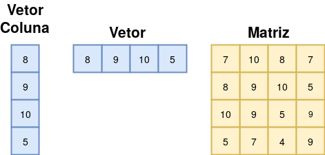
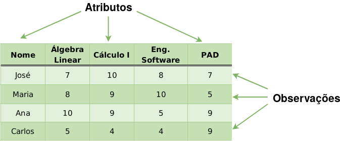

# Introdução ao R

**R** é uma linguagem de programação de alto nível voltada para visualização e análise de dados. Em essência foi inspirada na linguagem de programação __S__ (do inglês *stats*). Foi inicialmente escrita por [**R**oss Ihaka](https://en.wikipedia.org/wiki/Ross_Ihaka) e [**R**obert Gentleman](https://en.wikipedia.org/wiki/Robert_Gentleman_(statistician)) no departamento de estatística da universidade de Auckland na Nova Zelândia. Atualmente a linguagem é mantida pelo grupo __R Core Team__ que são pessoas do mundo inteiro tentando melhorar a linguagem dia após dia. Esse conteúdo foi baseado no livro *THE R BOOK* escrito por @crawley2012, sendo considerado a bíblia do R.

O kernel do **R** e os pacotes podem ser baixados pelo 
[CRAN](https://cran.r-project.org/) - *C*omprehensive **R** **A**rchive **N**etwork. Para instalar os pacotes em R:

```{r, eval=FALSE}
  # Via CRAN
  install.packages("nome_do_pacote")
  
  # Via github
  remotes::install_github("nome_do_repositorio/nome_do_pacote")

```

O objetivo deste capítulo é abordar, de forma introdutória, alguns conceitos básicos do R, por favor, sinta-se à vontade para contribuir.

## Definição de variáveis

Para atribuir qualquer valor à uma variável usamos uma seta `<-` ou `=`, apontando-a para a variável. Segundo @hadley2017, usa-se a seta `<-` como forma de boas práticas. Assim, para declarar as variáveis:

```{r}
  a <- "Olá!"
  b <- 42
  22 -> c
```

### Tipos primitivos

Agora que sabemos atribuir valores a uma variável, vamos falar sobre os tipos primitivos do **R**. Seguindo uma hierarquia, existe a classe pai: `numeric`, basicamente o `numeric` é todo número declarado sem sufixo e o seu tipo é `double`. No entanto, pode-se definir o tipo inteiro: `integer` colocando `L` na frente do valor (sufixo), e o tipo complexo: `complex` que por sua vez usa-se o `i`. Há também a classe `logical` que representa os valores booleanos `TRUE` e `FALSE`. Por último, a classe `character` que representa os caracteres. 

Para declarar cada tipo:

```{r}
  # Inteiro
  a <- 7L
  
  # Double
  b = 14.01
  
  # Booleano
  k <- FALSE
  
  # Complexo
  g <- 12i 
  
  # Caractere
  couse <- 'cool'
  
  # Para inspecionar o valor das variáveis
  b
 
  # Para verificar a classe
  class(a)
  
  # Para ver o tipo
  typeof(b)
  
  # Para removê-las
  rm(a)
  
```

> se quiser saber mais sobre o tipo `complex`, deixamos um link no subcapítulo [**Para saber mais**](https://dataat.github.io/introducao-analise-de-dados/introdu%C3%A7%C3%A3o-ao-r.html#para-saber-mais). 


### Tipos de dados estruturados

Agora que conhecemos os tipos primitivos, vamos aprender sobre vetores e matrizes. Apenas relembrando, podemos dizer que vetores sempre seguem um sentido, contendo uma linha e **N** colunas ou uma coluna e **N** linhas (Figura \@ref(fig:fig233)). Por outro lado, a matriz é um vetor bidimensional, composta por linhas e colunas.

```{r fig233, echo=FALSE ,fig.align="center", out.width = "50%",fig.cap='Estrutura de dados: Vetor e Matriz'}
  
```


No **R** há dois tipos de vetores:

- **Vetores atômicos**: compostos por todos os tipos citados anteriormente e mais um tipo chamado `raw`

- **Listas**: Chamadas de vetor recursivo e pode conter outras listas. 

Colocando de maneira simples, vetores atômicos são homogêneos, ou seja, apenas aceitam um tipo. Se alocado mais de um tipo no vetor, é convertido pelo tipo mais forte. A hierarquia de tipos é apresentada na Figura \@ref(fig:fig2).

```{r fig2, echo=FALSE ,out.width = "150%", fig.cap='Hierarquia de dados - Fonte: @hadley2017'}
  knitr::include_graphics("./images/tipos.png")

```


A Figura \@ref(fig:fig2) deve ser interpretada de baixo para cima. Seguindo essa ordem:

- `character`
- `complex`
- `numeric`
- `double`
- `logical`

Para declarar um vetor em R usa-se `c()`, desta forma:

```{r}
  # Vetor lógico
  vetor_boleano <- c(FALSE, TRUE, TRUE, FALSE)
  
  # Vetor númerico
  vetor_numerico <- c(3.14, 6.28, 2.3)
  
  # Vetor de caractere
  vetor_char <- c("ola", "pessoal", "!")
  
```

A conversão de tipos é apresentada na célula abaixo: 

```{r}
  # Esse é um vetor misturado
  vetor_misturado <- c("teste", FALSE, 21)

  # Visualização dos valores atribuídos
  vetor_misturado

```

Então, seguindo a ideia de hierarquia de tipos, esse vetor será convertido para `character` e continuará sendo atômico `r emo::ji("drum")`.

```{r}
  # Para verificar se é atômico
  is.atomic(vetor_misturado)

```

Por outro lado, as listas são heterogêneas, ou seja, aceitam diversos tipos, sendo organizadas em listas de listas. Por isso, são chamadas de vetores recursivos. Podemos implementá-las usando `list()`, deste modo:

```{r}
  # Lista de boleanos
  lista_boleano <- list(FALSE, TRUE, TRUE, FALSE)
  
  # Lista de inteiros
  lista_inteiro <- list(12L, 10L, 7L)
```

Podemos criar uma lista de diversos tipos, assim:

```{r}
  # Lista com todos os tipos 
  lista_misturada <- list(FALSE, 12L, 't', 2i)

  # Visualização da lista
  lista_misturada
```

Para verificar se a lista é atômica como o vetor que criamos:

```{r}
  # Séra ela atômica?
  is.atomic(lista_misturada)
```

Logo, temos uma lista não atômica, ou seja, de vários os tipos. Mas será ela uma lista mesmo? `r emo::ji("man_vampire_dark_skin_tone")`

```{r}
  # Verificar se é uma lista
  is.list(lista_boleano)
```

Podemos checar o tamanhos dos nossos vetores usando `length()`.

Já sabemos dos tipos de vetores, agora vamos para as matrizes. As matrizes seguem a mesma ideia dos vetores atômicos. Podemos implementá-la usando `matrix()`, deste modo: 
 
```{r} 
  library(knitr)

  # Minha matriz com números inteiros com caractere
   matriz <- matrix(data = c(1:25, rep("teste", 5)), nrow = 5, ncol=6)
   
   # Para visualizar a matriz
   knitr::kable(matriz)
```   

Então, seguindo a hierarquia de tipos, a nossa matriz será convertida para `character`. Podemos verificar seu tipo, desta forma:

```{r}
  # Para verificar se é matriz
  is.matrix(matriz)
  
  # Para consultarmos por index
  matriz[1,4]
```

Podemos acessar os valores através dos índices de linha e coluna `matriz[linha, coluna]`.

### Data Frame

Podemos definir **Data frame** como uma matriz (Figura \@ref(fig:fig233)), composta por linhas e colunas, cujas colunas representam as variáveis (atributos) e as linhas representam observações. A Figura \@ref(fig:fig322) apresenta um **Data frame**, na qual é possível observar as definições mencionadas anteriormente, desta forma, sabemos que o aluno **José** obteve **7** na disciplina de **Álgebra Linear**. 

```{r fig322, echo=FALSE ,fig.align="center", out.width = "80%",fig.cap=' Representação de um Data frame - Fonte: @gk4gk2019'}
  
```

O trecho de código a seguir apresenta a implementação do **Data frame** apresentado na Figura \@ref(fig:fig322).

```{r}
  # Importação do pacote 
  library(tibble)  
  
  # Criação do tibble
  df_escola <- tibble::tibble(Aluno = c("José", "Maria", "Ana", "Carlos"),
                              `Álgebra Linear` = c(7, 10, 8, 7),
                              `Cálculo I` = c(8, 9, 10, 5),
                              `Eng. Software` = c(10, 9, 5, 9),
                              `PAD` = c(5, 7, 4, 9))
    
  # Visualização dos dados 
  df_escola
```

Neste minicurso, vamos usar o pacote `tibble` no lugar do método `data.frame` contido no `base` do **R**, visto que o `tibble` possui diversas vantagens em relação ao tradicional `data.frame`, por exemplo, ainda no `tibble` criado anteriormente, é possível observar os tipos de cada atributo. Com o objetivo de facilitar a etapa de análise de dados, o pacote `tibble` não faz a conversão de atributos do tipo `character` para `factor` de forma automática.

Agora que sabemos a definição de um **Data frame**, vamos ler um conjunto de dados em `.csv` e observar algumas características: 

```{r, message=FALSE}
  # Importação do pacote readr
  library(readr)
  
  # Lendo nosso conjunto de dados
  iris <- readr::read_csv(file = "./data/iris.csv",)

  # Verificando a classe dos nossos dados
  class(iris)

  # Verificando o tipo dos nossos dados
  typeof(iris)
```

Podemos usar quaisquer métodos criados para uso no `data.frame` no `tibble`. O código acima mostra que o `tibble` criado possui três classes: `tbl_df`, `tbl` e `data.frame`. É possível observar que o `tibble` possui como classe comum o `data.frame`.

Podemos tirar algumas conclusões, a primeira é que existe uma classe chamada `data.frame` que é do tipo `list`, como visto anteriormente, a lista em **R** é heterogênea, logo, sabemos que nosso `Data frame` pode ter vários tipos. Para verificar se a classe `data.frame` é atômica:

```{r}
  # Verificando se é atomico nosso df
  is.atomic(iris)
```

Podemos acessar os atributos de um **Data Frame** de diversos modos, sendo um deles, utilizando o símbolo `$`:
```{r}
  # Para verificar as primeiras linhas
  head(iris$Species)
```

Vamos criar mais `Data Frame` para fixar o aprendizado:

```{r}
   # Criação do Data Frame
   data_frame <- tibble::tibble(
     Risco=c(FALSE,FALSE, FALSE, FALSE,TRUE),              
     Animal=c("Cachorro", "Gato", "Capivara", "Girafa", "Leão"),
     Periculosidade=c(200, 400, 0, 7, 1000))
  
  # Podemos acessar os valores individuais usando o '$'
  data_frame$Animal
```

```{r, echo=FALSE}
  # Visualização das lihas iniciais
  knitr::kable(head(data_frame, 3)) 
```


## Operações Básicas

Agora que sabemos como declarar uma variável, um vetor e um *Data frame*, nessa subseção vamos dar algumas dicas e falar sobre alguns métodos estatísticos.

### Dicas úteis

Para importar os pacotes no **R** usa-se o comando `library()`. Caso esteja com dúvida sobre uma determinada função, use o comando `?nome_do_pacote::nome_da_funcao`.

```{r, eval=FALSE}
  # Para importar um pacote
  library(kohonen)

  # Documentação da função som do pacote kohonen
  ?kohonen::som
```

Para especificar algum diretório para trabalhar, usamos o comando `setwd()` e para verificar o diretório atual `getwd()`.

```{r, eval=FALSE}
  # Para verificar seu diretório atual
  getwd() 
  
  # Para definir um novo diretório
  setwd("/home/felipe/R")
```

### Estatística básica

Vamos pular as definições das funções estatísticas que serão abordadas, sendo as medidas de posição:

- Média
- Mediana

e as medidas de dispersão:

- Desvio padrão

Para verificar o desvio padrão do conjunto, podemos utilizar a função `sd()` do pacote `stats` (já incluso no R). Podemos verificar a média com `mean()` que é uma função do pacote `base` (já incluso no R) e a mediana com `median()` do pacote `stats`.

Como demonstração, vamos utilizar o conjunto de dados do filme *Star Wars*:

```{r}
  # Vamos usar o dado do filme Star Wars do pacote dplyr*
  suppressMessages(library(dplyr))
  starwars <- dplyr::starwars
  
  # Vamos visualizar o dado
  dplyr::glimpse(starwars)
  
  # Vamos ver a média de ano de nascimento
  mean(starwars$birth_year)
  
  # Observe que o NA gera um erro na nossa média, vamos removê-lo
  mean(starwars$birth_year, na.rm = TRUE)
  
  # Mediana
  median(starwars$birth_year, na.rm = TRUE)
  
  # Podemos procurar pela menor data de nascimento
  min(starwars$birth_year, na.rm = TRUE)
  
  # Pelo máximo também
  max(starwars$birth_year, na.rm = TRUE)
  
  # Desvio padrão 
  sd(starwars$birth_year, na.rm = TRUE)
```

## Estruturas de decisão

Os `IF's` da vida - se chover e fizer frio, não vou à praia. No **R**, a estrutura de decisão é bem parecida com a do *Java*, ainda com o conjunto do *star wars*:

```{r}
  personagem <- "BB8"  

  if(personagem %in% starwars$name){
    "Tem o personagem BB8 nos dados"
  } else if("Padmé" %in% starwars$name) {
    "Tem a personagem Padmé nos dados"
  } else {
    "Não possui esse personagem"
  }
```

## Iteração

Para o `for` podemos utilizar o `foreach`, parecido com `Python`, desta maneira:

```{r}
  # Foreach
  for(i in head(starwars$name, 3)){
    print(i)
  }
```

## Manipulação de dados

Vamos utilizar o pacote `dplyr` do *kit* de ferramentas [**Tidyverse**](https://www.tidyverse.org/). Vamos criar um `data.frame` para a manipulação, desta maneira:

```{r}
meu_df <- tibble::tibble(
    aluno_id = c(1, 2, 3, 4, 5, 6),
    aluno_sexo = c("Masculino", "Feminino","Masculino", "Feminino", "Masculino", "Feminino"),
    aluno_curso = c("História", "História", "Matemática",
                    "Estatística", "Matemática", "Estatística"),
    aluno_media = c(2.1, 3.5, 4.0, 1.0, NA, 4.9),
    aluno_avaliacao = c("Ruim", "Ruim", "Excelente",
                        "Ruim", "Nenhum", "Excelente"))
```

```{r, echo=FALSE}
  knitr::kable(meu_df)
```


Vamos utilizar os seguintes métodos do pacote **dplyr**:

- `select` - Seleção de atributos de um **Data Frame**
- `filter` - Filtro de observações de acordo com uma lógica pré-definida 
- `mutate` - Criação de novos atributos 
- `group_by` - Criação de grupos para aplicação de funções de agregação
- `summarize` - Função de agregação aplicada em grupos

Vamos manipular nosso **Data Frame** com base nos métodos acima:

```{r}
  # Importação do pacote dplyr
  library(dplyr)
  
  # Filtro pelo atributo "aluno_avaliano"
  filtro <- dplyr::filter(meu_df, meu_df$aluno_avaliacao == "Ruim")
 
  # Seleção dos atributos "aluno_curso", "aluno_avaliacao" e "aluno_media"
  selecao <- dplyr::select(filtro, aluno_curso, aluno_avaliacao, aluno_media)
  
  # Criação de um grupo de cursos
  grupo <- dplyr::group_by(selecao, aluno_curso)
 
  # Agregação pela média de cada curso
  media <- dplyr::summarize(grupo, media_grupo = mean(aluno_media))
```

```{r, echo=FALSE}
  # Visualização das médias
  knitr::kable(media)
```


Basicamente, filtramos pelo atributo `aluno_avaliacao`, selecionamos os atributos `aluno_curso`, `aluno_avaliacao` e `aluno_media`, agrupamos pelos cursos e tiramos a média daquele grupo em relação os cursos `r emo::ji("bear")`. Mas, ficou muito grande, como podemos melhorar? Substituindo por apenas uma variável, desta forma: 

```{r}
  # Filtro pelo atributo "aluno_avaliano"
  meu_df1 <- dplyr::filter(meu_df, meu_df$aluno_avaliacao =="Ruim")

  # Seleção dos atributos "aluno_curso", "aluno_avaliacao" e "aluno_media"
  meu_df1 <- dplyr::select(meu_df1, aluno_curso, aluno_avaliacao, aluno_media)
  
  # Criação de um grupo de cursos
  meu_df1 <- dplyr::group_by(meu_df1, aluno_curso)
 
  # Agregação pela média de cada curso
  meu_df1 <- dplyr::summarize(meu_df1, media_grupo = mean(aluno_media))
```

```{r, echo=FALSE}
  # Visualização das médias
  knitr::kable(meu_df1)
```


Melhorou um pouco, não? `r emo::ji("blue")`. Podemos melhorar ainda mais, como? Usando `%>%` este símbolo, chamado de **pipe** ou **então**, basicamente, é a `pipe` utilizada no **Linux**.

A **pipe** passa a resposta da primeira atribuição para o primeiro parâmetro da função seguinte, desta forma:

```{r}
meu_vetor <- c(1, 3, 5, 7, 9) %>% mean()
  
meu_vetor

```

Então, podemos ver que não coloco o `meu_vetor` como parâmetro da função `mean()`, mas, e se eu quiser colocar mais parâmetros? Opa, você pode e deve, segue a mesma linha de raciocínio da função normal, desta forma:

```{r}
meu_vetor <- c(2, 4, 6, 8, NA) %>% mean(na.rm=TRUE)

meu_vetor
```

Agora, vamos otimizar nossa manipulação usando **pipe**, desta forma:

```{r}
  # exemplo de uso do operador pipe
  df <- meu_df %>% filter(aluno_avaliacao == "Ruim") %>%
    select(aluno_curso, aluno_avaliacao, aluno_media) %>%
    group_by(aluno_curso) %>%
    summarize(media_grupo = mean(aluno_media))
```

```{r, echo=FALSE}
  # Visualização do data frame
  knitr::kable(df)
```


Essa é a principal função do operador **pipe**, tornar o código mais limpo e reprodutível. 

Para encerrarmos esse capítulo de R, vamos mostrar uma análise de dados aplicável ao mundo real, com uso de dois conjuntos de dados, obtidos através da plataforma [kaggle](https://www.kaggle.com/). Os conjuntos de dados correspondem a série temporal da [mudança climática da temperatura da supércie terrestre](https://www.kaggle.com/berkeleyearth/climate-change-earth-surface-temperature-data) e os [continentes de cada país](https://www.kaggle.com/statchaitya/country-to-continent). O objetivo desta análise é verificar qual o continente que registrou a maior média anual de temperatura.

```{r, message=FALSE}
  # Importação dos pacotes utilizados
  library(readr)     # Leitura de dados retangulares
  library(dplyr)     # Métodos para manipulação de dados
  library(lubridate) # Métodos para trabalhar com dados do tipo date 
  
  # Leitura dos dados de mudança climática
  temperature_countries <-
  readr::read_csv("./data/GlobalLandTemperaturesByCountry.csv")

  # Leitura e seleção dos dados de continentes
  continent <- 
    readr::read_csv("./data/countryContinent.csv") %>%
    dplyr::select(country, continent) # Seleção do atributo continente

  # Filtro a partir do ano 2000 e extração da média anual (talvez não seja a melhor abordagem)
  year_temperature <- temperature_countries %>%
    dplyr::filter(dt > "2000-01-01")  %>% # Filtro a partir do ano 2000
    dplyr::mutate(dt = lubridate::year(dt)) %>% # Transformando pro tipo date
    dplyr::group_by(Country, dt) %>% # Criando um grupo de países
    dplyr::summarise(year_mean = mean(AverageTemperature)) # Agregação pela média
  
  # Junção dos continentes com cada país  
  final_dataset <- year_temperature %>% 
    dplyr::rename(country = Country) %>% # Alterando o nome do atributo
    dplyr::left_join(continent, by="country") %>% # Junção dos dois conjuntos
    dplyr::filter(!is.na(continent)) # Remoção dos valores NA 
  
  # Visualização dos dados
  head(final_dataset, 5)
```

Agora vamos responder a nossa pergunta: qual o continente que registrou a maior temperatura anual?

```{r}
  # Criação de um grupo de continentes e agregando pela maior temperatura
  final_dataset %>%
  dplyr::group_by(continent) %>% # Grupo de continentes
  summarise(maior_temp = max(year_mean, na.rm = TRUE)) # Agregação pela temp max
```

Podemos gerar outras perguntas, por exemplo, qual o ano com a maior média de temperatura registrada?

```{r}
  # Criação de um grupo de anos e agregação pelo valor da temperatura, por fim ordenação pelos valores de temperatura
  final_dataset %>%
  dplyr::group_by(dt) %>% # Grupo dos anos 
  dplyr::summarise(maior_temp = max(year_mean, na.rm = TRUE)) %>% # Agregação pelo max
  dplyr::arrange(desc(maior_temp)) %>% # Ordenação pela temperatura
  head(5)
```

Enfim, podemos responder diversas perguntas com poucas linhas de código. Esperamos que este capítulo tenha despertado sua curiosidade sobre análise de dados. Os materiais base utilizados para criação deste capítulo se encontram nesta [subseção](https://dataat.github.io/introducao-analise-de-dados/introdu%C3%A7%C3%A3o-ao-r.html#para-saber-mais).


## Para saber mais

Este foi só o começo! Para continuar e aprender mais, consulte:

- [Números complexos](https://stat.ethz.ch/R-manual/R-devel/library/base/html/complex.html)
- [Tipos númericos em R](http://uc-r.github.io/integer_double/)
- [Diferença entre lista e vetor](https://www.burns-stat.com/documents/tutorials/impatient-r/)
- [Documentação do CRAN](https://cran.r-project.org/doc/FAQ/R-FAQ.html#Introduction)
- [R eficiente](https://csgillespie.github.io/efficientR/)
- [R 4 Data Science](https://r4ds.had.co.nz/)
- [Material da matéria CAP-394 (INPE)](!https://github.com/rafaeldcsantos/CAP-394)
