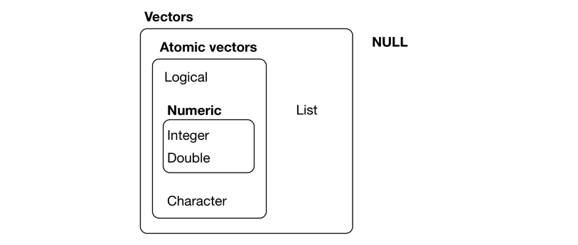

# Introdução ao R

**R** é uma linguagem de programação de alto nível voltada para visualização e análise de dados. Em essência foi inspirada na linguagem de programação __S__. Foi inicialmente escrito por [**R**oss Ihaka](https://en.wikipedia.org/wiki/Ross_Ihaka) and [**R**obert Gentleman](https://en.wikipedia.org/wiki/Robert_Gentleman_(statistician)) no departamente de estatística da universidade de Auckland na Nova Zelândia. Atualmente a linguagem **R** é mantido pelo grupo __R Core Team__ que são pessoas do mundo inteiro tentando melhorar a linguagem dia após dia. Esse conteúdo foi baseado no livro *THE R BOOK* escrito por @crawley2012, sendo considerado a bíblia do R.

O kernel do **R** e os pacotes podem ser baixados pelo CRAN - *C*omprehensive **R** **A**rchive **N**etwork. O objetivo deste capítulo é trazer de forma introdutória alguns conceitos básicos do R, por favor, sinta-se à vontade para contribuir.

## Definição de variáveis

Para atribuir qualquer valor em uma variável usamos a `<-` ou `=`, segundo @hadley2017, usa-se seta `<-` como boas práticas. Desta forma, para declarar as variáveis:

```{r}
  a <- "Legal mesmo!"
  b <- 4224
  22 -> c
```

### Tipos primitivos

Agora que sabemos atribuir valores a uma variável, vamos falar sobre os tipos primitivos do *R*. Seguindo uma hierarquia, existe a classe "pai" `numeric`, basicamente o `numeric` é todo número declarado sem sufixo e o seu tipo é `double`. No entanto, pode-se definir o tipo `integer` colocando `L` na frente do valor (sufixo), e o `complex` que por sua vez usa-se o `i`. Há também a classe `logical` que representa os valores booleanos `TRUE` e `FALSE`. Por último, a classe `character` que representa os caracteres. 

Para declarar cada tipo:

```{r}
  # Inteiro
  a <- 7L
  
  # Double
  b = 14.01
  
  # Boleano
  k <- FALSE
  
  # Complexo
  g <- 12i 
  
  # Caractere
  couse <- 'cool'
  
  # Para ver inspecionar o valor das variáveis
  b
 
  # Para ver as classes
  class(a)
  
  # Para ver o tipo
  typeof(b)
  
  # Para remove-las
  rm(a)
  
```

> se quiser saber mais sobre o tipo `complex`, deixamos um link no subcapítulo _Para saber mais_. 


### Tipos de dados estruturados

Já que conhecemos os tipos primitivos, vamos aprender sobre vetores e matriz. Apenas relembrando, podemos dizer que vetores sempre seguem um sentido e contém apenas uma linha e _N_ colunas. Por outro lado, a matriz é um vetor bidimensional, composta por linhas e colunas.

No **R** há dois tipos de vetores:

- **Vetores atômicos**: compostos por todos os tipos citados a cima e mais um tipo chamado `raw`

> Tipos citados: `double`, `logical`, `integer`, `character` e `complex`.

- **Listas**: Chamadas de vetor recursivo e pode conter outras listas. 

Colocando de maneira simples, vetores atômicos são homogêneos, ou seja, apenas aceitam um tipo. Se alocado mais de um tipo no vetor, o que acontece? Simples, é convertido pelo tipo mais forte `r emo::ji("chemist")`. A hierarquia de tipos é apresentada na Figura \@ref(fig:fig2).

```{r fig2, echo=FALSE ,out.width = "150%", fig.cap='Hierarquia de dados - Fonte: @hadley2017'}
  

```


A Figura \@ref(fig:fig2) deve ser interpretada de baixo para cima. Seguindo essa ordem:

- `character`
- `complex`
- `numeric`
- `double`
- `logical`

Todo vetor em R é declarado usando `c()`, desta forma:

```{r}
  # Vetor lógico
  vetor_boleano <- c(FALSE, TRUE, TRUE, FALSE)
  
  # Vetor númerico
  vetor_numerico <- c(3.14, 6.28, 2.3)
  
  # Vetor de caractere
  vetor_char <- c('ola', 'pessoal', 'xd')
  
```

A conversão de tipos é apresentado na célula abaixo: 

```{r}
  # Esse é um vetor misturado
  vetor_misturado <- c("sou legal", FALSE, 21)

  # Podemos verificá-lo assim
  is.atomic(vetor_misturado)
```

Então, seguindo a ideia de hierarquia de tipos, esse vetor será convertido para `character` e continuará atômico `r emo::ji("drum")`.

Por outro lado, as listas são heterogêneas, ou seja, aceitam diversos tipos, sendo organizadas em lista de lista. Por isso, é chamado de vetor recursivo. Podemos implementá-la usando `list()`, deste modo:

```{r}
  # Lista de boleanos
  lista_boleano <- list(FALSE, TRUE, TRUE, FALSE)
  
  # Lista de inteiros
  lista_inteiro <- list(12L, 10L, 7L)
```

E a ideia de vários tipos? foi tudo uma mentira? `r emo::ji("doubt")`

Não foi mentira, vamos criar uma lista de diversos tipos, assim:


```{r}
  # Minha lista com todos os tipos 
  lista_misturada <- list(FALSE, 12L, 't', 2i)
  
  # Será ela atomica?
  is.atomic(lista_misturada)
  
```
 
Viu, não era mentira, temos uma lista não atômica, ou seja, de vários os tipos. Mas será ela uma lista mesmo? `r emo::ji("man_vampire_dark_skin_tone")`

```{r}
  # Você é uma lista mesmo?
  is.list(lista_boleano)
```

Ufa, ainda bem! `r emo::ji("face_with_tears_of_joy")`. Esqueci de dizer, que podemos checar o tamanhos dos nossos vetores usando `length()`.

Já sabemos de tipos de vetores, agora vamos para as matrizes. Bom, as matrizes seguem a mesma ideia dos vetores atômicos, confesso que não uso com frequência, mas sempre é válido saber. Podemos implementá-la usando `matrix()`, deste modo: 
 
```{r} 
  library(knitr)

  # Minha matriz com números inteiros com caractere
   matriz <- matrix(data = c(1:25, rep("legal", 5)),       nrow = 5, ncol=6)
   
   # Para ver nossa matriz
   knitr::kable(matriz)
```   

Então, seguindo a hierarquia de tipos, a nossa matriz será convertida para `character`. Podemos verificar seu tipo, desta forma:

```{r}
  # É matriz mesmo?
  is.matrix(matriz)
   
  # Sou legal ou chato?
  matriz[5,6]

```

Podemos acessar os valores através dos índices de linha e coluna `matriz[linha, coluna]`.

### DataFrame

Para explicar o conceito de `dataframe`, vamos começar pela prática. Primeiro, vamos ler um conjunto de dados em `.csv` e observar algumas características: 

```{r}
  # Lendo nosso conjunto de dados
  meu_dataframe <- read.csv2(file = "./nome_do_csv.csv",       sep=",")
  
  # Verificando a classe do nosso conjunto de dados
  class(meu_dataframe)
  
  # Verificando o tipo do nosso conjunto de dados
  typeof(meu_dataframe)
```

> A ideia do `read.csv` é ler um `.csv` e passar para dataframe no R 

Podemos tirar algumas conclusões, a primeira é que existe uma classe chamada `data.frame` que é do tipo `list`, como visto anteriormente a lista em **R** é heterogênea, logo, sabemos que nosso `dataframe` pode ter vários tipos `r emo::ji("grinning_face")`. Para verificar a classe `data.frame` é atômica:


```{r}
  # Verificando se é atomico nosso df
  is.atomic(meu_dataframe)
```

Opa, então sabemos que `dataframe` é uma classe no **R** tratada como um tipo `list`. Mas, afinal, o que é um **dataframe**? `r emo::ji("hand")`

Vou usar a definição feita pelo livro de [Limpeza de dados em R](tps://cdr.ibpad.com.br):

> Tipo especial de lista, onde cada coluna é um vetor de apenas um tipo e todas as colunas têm o mesmo número de registros. É o tipo mais utilizado para se trabalhar com dados

Que definição interessante, então, cada 'coluna' é vetor um atômico? 

Para acessar cada coluna do `data.frame` usamos o símbolo `$`. Agora, vamos responder a pergunta, deste modo:

```{r}
  # é atomico?
  is.atomic(meu_dataframe$Pclass) 
```


Olha só, é atômico. Então, vamos criar uma dataframe, para fixar o aprendizado:


```{r}
   # DataFrame[3]
   data_frame <- data.frame(
     Risco=c(FALSE,FALSE, FALSE, FALSE,TRUE),                Animal=c("Cachorro", "Gato", "Capivara", "Girafa", "Macaco"),
     Periculosidade=c(200, 400, 0, 7, 1000))
  
  # Podemos acessar os valores individuais usando o '$'
  data_frame$Animal
  
  # Visualização das lihas iniciais
  knitr::kable(head(data_frame, 3)) 
 
```


## Operações Básicas

Agora que já sabemos como declarar uma variável, um vetor e um dataframe, nessa seção vamos dar algumas dicas e falar sobre alguns métodos estatísticos.

### Dicas úteis

Para importar os pacotes no **R** usa-se o comando `library()` e para instalar `install.packages()`. Caso esteja com dúvida sobre uma determinada função, use o comando `?nome_da_funcao()` ou `pacote::nome_da_funcao`.
```{r, eval=FALSE}
  # Para usar algum pacote
  library(kohonen)

  # Para instalar algum pacote que esteja
  #install.packages("meupacotefavorite")
  
  # Função do pacote kohonen
  ?som()
```

Para especificar algum diretório para trabalhar, usamos o comando `setwd()` e para verificar o diretório atual `getwd()`.

```{r}
  # Para verificar seu diretório atual
  getwd() 
  
  # Para definir um novo diretório
  #setwd("~/R/ggsom/")
```

### Estatística básica

Vamos pular as definições das funções estatísticas que serão abordadas, sendo as medidas de posição:

- Média
- Mediana

e as medidas de dispersão:

- Desvio padrão

Para verificar o desvio padrão do conjunto, podemos utilizar a função `sd()` do pacote `stats`. Podemos verificar a média com `mean()` que é uma função do pacote `base` e a mediana com `median()` do pacote `stats`.

Como demonstração, vamos utilizar o conjunto de dados do filme *star wars* `r emo::ji("smiling_face")`


```{r}
  # Vamos usar o dado do filme Star Wars do pacote dplyr*
  suppressMessages(library(dplyr))
  starwars <- dplyr::starwars
  
  # Desse modo o dataset é carregado no nosso ambiente, use ls()
  data(starwars)
  
  # Vamos visualizar o dado
  dplyr::glimpse(starwars)
  
  # Vamos ver a média de ano de nascimento
  mean(starwars$birth_year)
  
  # oops... - Observe que o NA atrapalha nossa média,vamos removê-lo
  mean(starwars$birth_year, na.rm = TRUE)
  
  # Mediana
  median(starwars$birth_year, na.rm = TRUE)
  
  # Podemos procurar pela menor data de nascimento
  min(starwars$birth_year, na.rm = TRUE)
  
  # Pelo máximo também
  max(starwars$birth_year, na.rm = TRUE)
  
  # Desvio padrão 
  sd(starwars$birth_year, na.rm = TRUE)
```

## Estruturas de decisão

Os `IF's` da vida, se não fosse por isso, aconteceria tal coisa. 
Bom, no **R**, a estrutura de decisão é bem parecida com a do *Java*, ainda com o conjunto do *star wars*:
```{r}
  personagem <- "BB8"  

  if(personagem %in% starwars$name){
    "Tem o personagem BB8 nos dados"
  } else if("Padmé" %in% starwars$name) {
    "Tem a personagem Padmé nos dados"
  } else {
    "Não possui esse personagem"
  }
```

## Iteração

Para o `for` podemos utilizar o famoso `foreach`, parecido com `Python`, desta maneira:

```{r}
  # Foreach
  for(i in head(starwars$name, 3)){
    print(i)
  }
```

## Manipulação de dados

Vamos utilizar o pacote `dplyr` do kit de ferramentas [**Tidyverse**](https://www.tidyverse.org/). Vamos criar um `data.frame` para a manipulação, desta maneira:

```{r}
meu_df <- data.frame(
    aluno_id = c(1, 2, 3, 4, 5, 6),
    aluno_sexo = c("Masculino", "Feminino","Masculino", "Feminino", "Masculino", "Feminino"),
    aluno_curso = c("Historia", "Historia", "Matemática",
                    "Estatística", "Matemática", "Estatística"),
    aluno_media = c(2.1, 3.5, 4.0, 1.0, NA, 4.9),
    aluno_avaliacao = c("Ruim", "Ruim", "Excelente",
                        "Ruim", "Nenhum", "Excelente"))

  knitr::kable(meu_df)
  
```

Vamos utilizar os seguintes métodos de manipulação do **dplyr**:

- `select` - Seleciona as colunas do dataframe
- `filter` - Filtra algum valor da coluna
- `mutate` - Cria novas variáveis no dataframe
- `group_by` - agrupa de acordo com um vetor de categorias
- `summarize` - Reduz os valores para um único resumo.

Vamos manipular nosso `dataframe` com base nos métodos a cima:

```{r}
library(dplyr)
  
filtro <- dplyr::filter(meu_df, meu_df$aluno_avaliacao == "Ruim")
 
selecao <- dplyr::select(filtro, aluno_curso, aluno_avaliacao, aluno_media)
  
grupo <- dplyr::group_by(selecao, aluno_curso)
 
media <- dplyr::summarize(grupo, media_grupo = mean(aluno_media))
  
knitr::kable(media)
 
```

Basicamente, filtramos pelo atributo `aluno_avaliacao`, selecionamos os atributos `aluno_curso`, `aluno_avaliacao` e `aluno_media`, agrupamos pelos cursos e tiramos a média daquele grupo em relação os cursos `r emo::ji("bear")`. Mas, ficou muito grande, não podemos melhorar? Podemos sim, substituindo por apenas uma variável, desta forma: 

```{r}
meu_df1 <- dplyr::filter(meu_df, meu_df$aluno_avaliacao =="Ruim")
 
meu_df1 <- dplyr::select(meu_df1, aluno_curso, aluno_avaliacao, aluno_media)
  
meu_df1 <- dplyr::group_by(meu_df1, aluno_curso)
 
meu_df1 <- dplyr::summarize(meu_df1, media_grupo = mean(aluno_media))
  
knitr::kable(meu_df1)

```

Aee, melhorou um pouco, não? `r emo::ji("blue")`. Podemos melhorar ainda mais, como? Usando `%>%` este símbolo, chamado de **pipe** ou **então**, basicamente, é a `pipe` utilizada no **Linux**, mas o que faz?

A **pipe** passa a resposta da primeira atribuição para o primeiro parâmetro da função seguinte, desta forma:

```{r}
meu_vetor <- c(1, 3, 5, 7, 9) %>% mean()
  
meu_vetor

```

Então, podemos ver que não coloco o `meu_vetor` como parâmetro para a função `mean()`, mas, e se eu quiser colocar mais parâmetros? Opa, você pode e deve, segue a mesma linha de racíocio da função normal, desta forma:

```{r}
meu_vetor <- c(2, 4, 6, 8, NA) %>% mean(na.rm=TRUE)

meu_vetor
```

Agora, vamos otimizar nossa manipulação usando **pipe**, desta forma:

```{r}
  df <- meu_df %>% filter(aluno_avaliacao == "Ruim") %>%
    select(aluno_curso, aluno_avaliacao, aluno_media) %>%
    group_by(aluno_curso) %>%
    summarize(media_grupo = mean(aluno_media))
  
 knitr::kable(df)
```

Essa é a principal função do **pipe**, tornar o código mais limpo e reprodutível.


## Para saber mais

[Números complexos - 1](!https://stat.ethz.ch/R-manual/R-devel/library/base/html/complex.html)

[Tipos númericos em R - 2](!http://uc-r.github.io/integer_double/)

[Diferença entre lista e vetor - 3](!https://www.burns-stat.com/documents/tutorials/impatient-r/)

[CRAN - 4](!https://cran.r-project.org/doc/FAQ/R-FAQ.html#Introduction)

[R eficiente - 5](!https://csgillespie.github.io/efficientR/)


###  Materiais utilizados como base
[Rafael Santos](!https://github.com/rafaeldcsantos/CAP-394)

- José Roberto M. Garcia


