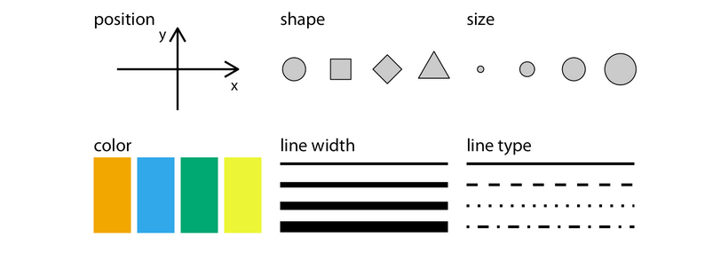

# Introdução ao ggplot `r emo::ji("bar_chart")`

A visualização de dados pode ser considerada uma das mais importantes etapas do processo de análise de dados, é através dela que diversos fenômenos presentes nos dados poderão ser explicados e visualizados.

> Quando não souber como explicar, mostre, afinal, uma imagem vale mais que mil palavras.

Porém, criar formas de visualizar dados pode não ser uma atividade simples, muitas etapas acabam sendo necessárias. É neste contexto que entra o `ggplot`, uma biblioteca de alto nível, criada para tornar o processo de visualização de dados mais simples, possuindo implementações em **R** com o pacote [ggplot2](https://ggplot2.tidyverse.org/) e em **Python** com o pacote [plotnine](https://plotnine.readthedocs.io/en/stable/), ambos completamente compativeis.

Esta seção faz a apresentação aos conceitos básicos necessários para a utilização do `ggplot`.

> Os exemplos abaixo serão apresentados utilizando **R**, mas você pode sem nenhum problema executar os códigos em **Python** através da biblioteca `plotnine`.

## O que é o `ggplot`?

Bom, `ggplot`é um pacote em R criado por _Hadley Wickham_ e seus colaboradores, como mencionado anteriormente, sua sintaxe se baseia na obra [The Grammar of Graphics](https://www.amazon.com/Grammar-Graphics-Statistics-Computing/dp/0387245448). Assim, a **gramática dos gráficos** é um conjunto de camadas, cujo o mapeamento dos atributos é chamado de _aesthetics_. O esqueleto pode ser escrito assim:

```{r,eval = FALSE}
  ggplot(data = <DATA>, aes(<MAPPINGS>)) + 
  <GEOM_FUNCTION>(
     mapping = aes(<MAPPINGS>),
     stat = <STAT>, 
     position = <POSITION>
  ) +
  <COORDINATE_FUNCTION> +
  <FACET_FUNCTION>  
```

Vamos explicar linha por linha do código acima. Vamos lá `r emo::ji("calculation")`.

## Mapeamento Estético

Podemos mapear dentro da função `ggplot()` ou dentro de alguma geometria. A imagem abaixo, retirada do livro do @claus2019, mostra os métodos geométricos do mapeamento estético.




Vamos começar criando um **Data frame**, deste modo:

```{r}
  # importação do pacote tibble 
  library(tibble)
  
  escola <- tibble::tibble(
    aluno_id = c(1, 2, 3, 4, 5, 6),
    aluno_sexo = c("Masculino", "Feminino","Masculino", "Feminino", "Masculino", "Feminino"),
    aluno_curso = c("Historia", "Historia", "Matemática",
                    "Estatística", "Matemática", "Estatística"),
    aluno_media = c(2.1, 3.5, 4.0, 1.0, NA, 4.9),
    aluno_avaliacao = c("Ruim", "Ruim", "Excelente",
                        "Ruim", "Nenhum", "Excelente"))
```

```{r, echo=FALSE}
   knitr::kable(escola)
```


Agora, vamos mapear os atributos do nosso **Data Frame** `escola`, desta forma:

```{r}
  # Importação do pacote ggplot2
  library(ggplot2)
  
  # Mapeamento estético 
  ggplot(escola, aes(x=aluno_id, y=aluno_media, color=aluno_curso))

```

Bom, agora que mapeamos nossos atributos é possível ver que no eixo `x` está escrito `aluno_id` e no eixo `y` está escrito `aluno_media`. 


## Objetos geométricos

Aprendemos o mapeamento estético, agora vamos colocar alguns objetos geométricos no nosso gráfico, com base nessa tabela, retirado da livro [Ciência de dados em R](https://cdr.ibpad.com.br/):

---------------------------------------------------------------------------------------------------------------------
                          Tipo                                                          Objeto Geométrico
------------------------------------------------------------    -----------------------------------------------------
                 Dispersão (scatterplot)                                                  `geom_point()`        
                 
                 Gráfico de bolhas                                                        `geom_point()`
                 
                 Gráfico de barras                                                    `geom_bar()` e `geom_col()`                      
                 Histograma                                                               `geom_histogram()`    
                 
                 Boxplot                                                                  `geom_boxplot()`
                 
                 Densidade                                                                `geom_density()`
                 
                 Gráfico de linhas                                                        `geom_line()`
----------------------------------------------------------------------------------------------------------------------

Vamos utilizar `geom_point` para fazer um gráfico bolhas no conjunto de dados, deste modo:

```{r}
  # Adição de um objeto geométrico
  ggplot(escola, aes(x=aluno_id, y=aluno_media, color=aluno_curso)) + 
    geom_point(na.rm = TRUE) 
```


Olha que legal. No entanto, ainda faltam informações no nosso gráficos, por exemplo, no eixo `x`, não sabemos se começa com 0 ou 1 e o nome dos nossos atributos não estão informativos. 


## Escalas

Bom, agora é a hora de melhorar nosso gráfico, que por sinal está bem estranho, vamos lá!

Primeiro, vamos mudar o nome dos nossos atributos em cada eixo e também mudar as escalas:

```{r}
  # Adição de escalas no eixo x e y
  ggplot(escola, aes(x=aluno_id, y=aluno_media, color=aluno_curso)) + 
    geom_point(na.rm = TRUE) +
    scale_x_continuous(name = "Identificação dos alunos", breaks = 1:6) + 
    scale_y_continuous(name="Média dos alunos", breaks = seq(1, 6, 0.5))

```

Ainda falta mais informações, por exemplo, o título do nosso gráfico e melhorar a legenda. 

```{r}
  # Definição de cores para cada disciplina
  cores <- c("Estatística" = "green",
             "Historia" = "red",
             "Matemática" = "blue")
  
  # Alteração da legenda e adição de um título
  ggplot(escola, aes(x=aluno_id, y=aluno_media, color=aluno_curso)) + 
    geom_point(na.rm = TRUE) + 
    scale_x_continuous(name = "Identificação dos alunos", breaks = 1:6) + 
    scale_y_continuous(name="Média dos alunos", breaks = seq(1, 6, 0.5)) +
    scale_color_manual("Disciplinas", values = cores) + 
    ggtitle("Média dos alunos da faculdade")
```

É possível observar que o aluno com id **5** não possui média em nenhuma disciplina. Agora, que tal dividirmos nosso gráfico em sub gráficos? `r emo::ji("cool")`.

## Subplots

Bom, é possível visualizar de forma dividida nosso gráfico em subgráficos, usando `facet_wrap`, desta forma:


```{r}
  # Definição de cores para cada disciplina
  cores <- c("Estatística" = "green",
             "Historia" = "red",
             "Matemática" = "blue")
  
  # Craiação de subgráficos pela avaliação de cada aluno 
  ggplot(escola, aes(x=aluno_sexo, y=aluno_media, color=aluno_curso)) + 
    geom_point(na.rm = TRUE) + 
    facet_grid(~ aluno_avaliacao) + 
    labs(title="Notas dos alunos por grid", 
       x = "Sexo dos alunos",
       y = "Média dos alunos") + 
    scale_color_manual("Matérias", values = cores) + 
    ggtitle("Média dos alunos da faculdade")


```

Usei `labs` para mostrar que essa função também altera o nome dos eixos.

## Temas

Por último, vamos deixar nosso gráfico mais elegante, usando os temas do próprio pacote:

```{r}
  
  # Definição de cores para cada disciplina
  cores <- c("Estatística" = "green",
             "Historia" = "red",
             "Matemática" = "blue")
  
  # Adição do tema "theme_bw()"
  ggplot(escola, aes(x=aluno_id, y=aluno_media, color=aluno_curso)) + 
    geom_point(na.rm = TRUE) + 
    scale_x_continuous(name = "Identificação dos alunos", breaks = 1:6) + 
    scale_y_continuous(name="Média dos alunos", breaks = seq(1, 6, 0.5)) + 
    scale_color_manual("Matérias", values = cores) + 
    ggtitle("Média dos alunos da faculdade") + 
    theme_bw()
```


## Exemplos 

Nesta subseção vamos usar conjuntos de dados reais para demonstrar o uso do `ggplot2` com mais exemplos.

### Gráfico de coordenadas paralelas

```{r}
  # importação dos pacotes usados
  library(tidyr)
  library(dplyr)

  # Uso dos dados da iris
  data("iris")
  
  # Criação do gráfico de coordenadas paralelas
  iris %>% dplyr::mutate(id = 1:nrow(iris)) %>% # Criação de um atributo id
    tidyr::gather(atributos, valores, -Species, -id) %>% # Transformando em wide para long
    ggplot(., aes(x = atributos, y = valores, color = Species, group = id)) + # mapeamento estético
    geom_line(size=0.55) + # Objeto geométrico
    labs(x       = "Atributos",
         y       = "Valores", 
         title   = "Coordenadas Paralelas - Iris",
         caption = "Fonte: dataAt") + # legendas
    theme_bw() + # Adição do tema "theme_bw()"
    theme(plot.title = element_text(hjust= 0.5, margin = margin(b = 7))) 
```

Assim como apresentado anteriormente, podemos dividir nosso gráfico em subgráficos, desta forma:

```{r}
  # Criação do gráfico de coordenadas paralelas
  iris %>% dplyr::mutate(id = 1:nrow(iris)) %>%
    tidyr::gather(atributos, valores, -Species, -id) %>%
    ggplot(., aes(x = atributos, y = valores, color = Species, group = id)) + 
    geom_line(size=0.55) +
    facet_grid(~Species) + 
    labs(x     = "Atributos",
         y     = "Valores", 
         title = "Coordenadas Paralelas - Iris") +
    theme_bw() + 
    theme(plot.title = element_text(hjust= 0.5, margin = margin(b = 7)),
          axis.text.x = element_text(angle = 90)) 
```


Observe que todos conteúdos apresentados neste livro estão sendo utilizados nos gráficos apresentados acima. 

## Gráfico de colunas

Para criar nosso gráfico de colunas vamos utilizar o conjunto de dados de tempestade, desta forma:

```{r}
  # Importação dos dados como variável de ambiente
  data("storms")
  
  # Visualização dos dados
  head(storms, 5)
```

> Para mais informações do conjunto de dados, basta utilizar `?storms`

Como podemos observar, o dado consiste em um série temporal de tempestades registradas. Qual é o tipo de tempestade mais recorrente?

```{r}
  # Temas para o pacote ggplot2
  library(cowplot)
  library(forcats) 

  storms %>% dplyr::group_by(status) %>% 
    dplyr::summarise(count = n()) %>% 
    dplyr::mutate(status = forcats::fct_reorder(status, count)) %>% 
    ggplot(., aes(x = status, y = count)) +
    geom_col(width = 0.5) + 
    theme_minimal_hgrid() + 
    labs(x       = "Tipos de tempestade",
         y       = "Quantidade",
         title   = "Gráfico de colunas - Storms") + 
    theme(plot.title = element_text(hjust= 0.5, margin = margin(b = 7)))
    
```


O pacote `ggplot2` possui diversas [extensões oficiais](https://www.ggplot2-exts.org/gallery/), as quais implementam diversos métodos de visualização. No próximo exemplo vamos usar a extesão [Lemon](https://github.com/stefanedwards/lemon).


## Extensão do ggplot2 - Lemon

Nesta subseção vamos utilizar os dados dos preços de diamantes, podemos importá-lo desta forma:

```{r}
  # Importação do conjunto de dados como variável de ambiente
  data("diamonds")

  # Visualização das cinco primeiras observações
  head(diamonds, 5)
```

Vamos utilizar os atributos `cut`, `price` e `clarity`, correspodentes a qualidade do corte do diamente, ao preço e a medição de qualidade, respectivamente. 


```{r}
  # importação do pacote Lemon
  library(lemon)
  
  # Definição da semente para garantir reprodutibilidade
  set.seed(123)
  
  # amostragem dos dados
  amost <- sample(c(1:nrow(diamonds)), nrow(diamonds)*0.1, replace = FALSE)
  amost_diam <- diamonds[amost,]
  
  amost_diam %>%
    ggplot(., aes(x = as.factor(cut), y = price, color = clarity)) + 
    geom_point(position=position_jitter(width=0.08)) + 
    coord_flex_cart(bottom=brackets_horisontal(), left=capped_vertical('both')) +
    theme_light() +
    theme(panel.border=element_blank(), axis.line = element_line(),
          plot.title = element_text(hjust= 0.5, margin = margin(b = 7))) + 
    labs(x     = "Qualidade do corte",
         y     = "Preço em US",
         title = "Gráfico de bolhas - Diamonds")
```


Bom, sabemos que o `ggplot` é bem completo, mas, só abordamos uma pequena parcela. Com o tempo vamos adicionando mais materiais. Para se aprofundar no pacote, veja nossas análises no [dataAt](https://github.com/dataAt/introducao-analise-de-dados/tree/master/src/R) `r emo::ji("dancer")`.

## Para saber mais

Alguns links úteis

- [Tipos de gráficos](https://camo.githubusercontent.com/ea2e9eda9b01fafc1213f5c400aa357584f40df8/687474703a2f2f626c6f672e76697375616c2e6c792f77702d636f6e74656e742f75706c6f6164732f323031342f30392f696d6167652d362e706e67)
- [Ciencia de dados em R](https://cdr.ibpad.com.br/)
- [dataviz](https://serialmentor.com/dataviz)
- [Escolhendo seus gráficos](https://www.ibpad.com.br/blog/analise-de-dados/qual-e-o-grafico-mais-adequado/)

# References
